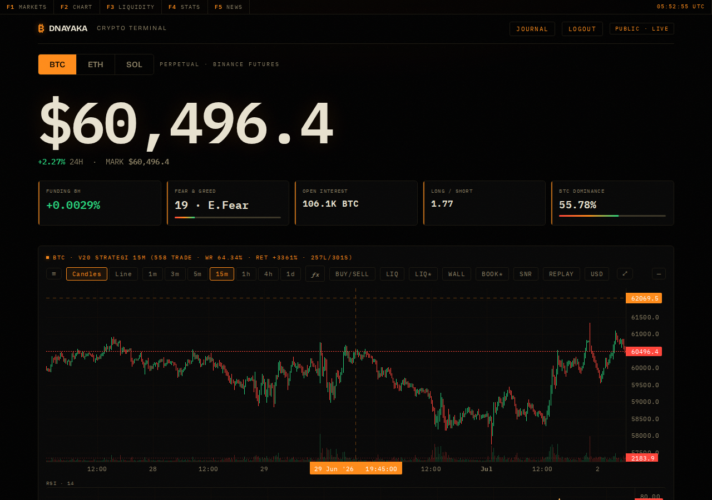
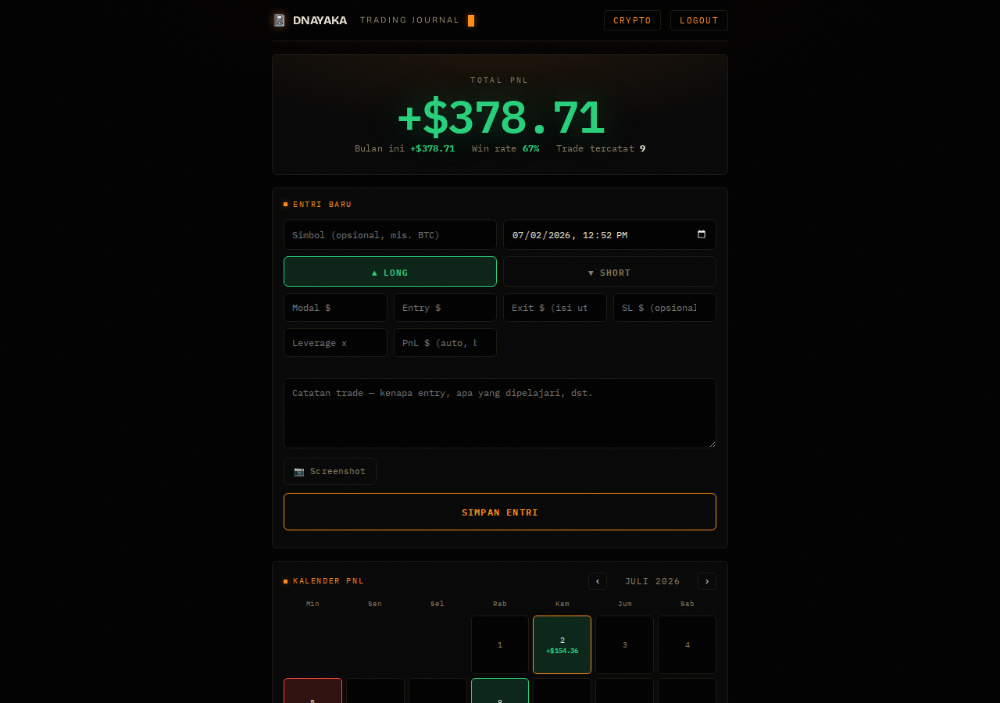
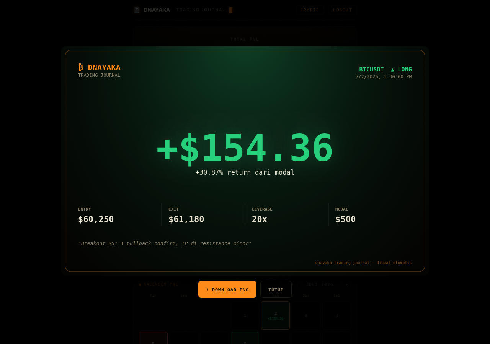
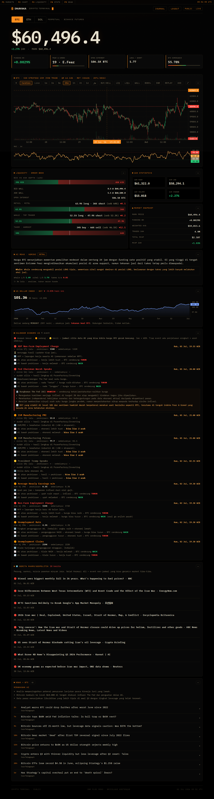

# Crypto Terminal — BTC/ETH/SOL Trading Dashboard

This is a trading terminal I built from scratch: a Bloomberg-style dashboard for BTC/ETH/SOL perpetuals, running a momentum strategy I've spent months backtesting, a live bot that trades that exact strategy (paper or real), and a personal trading journal on top. No React, no build step, no bloated framework — just Python's `http.server` and vanilla JS, and it still holds up under 1000 concurrent users with zero errors (see [Risk controls](#risk-controls-circuit-breaker--statistical-tripwire) and the load-testing notes below).

The short version: point it at your Binance account, watch the chart, let the bot do its thing (or don't — paper mode is the default and the safe one), and journal your own trades alongside it. Everything here is disclosed, including the parts that *didn't* work — see the [Safety notes](#safety-notes) before you plug in real money.

## Screenshots

| | |
|---|---|
|  |  |
| Live chart with the strategy overlaid — entries, exits, TP/SL zones — plus liquidity and market panels | The trading journal: total PnL, win rate, a month-by-month calendar of good and bad days |
|  |  |
| Every trade you log can turn into a shareable card, one click, downloadable as PNG | The full page — liquidity heatmap, AI market read, DXY, economic calendar, geopolitical news, news wire |

*(The numbers in these screenshots are synthetic demo data, made up to show the UI — not a real track record. More on that below.)*

## What makes this worth a look

Most "crypto bot" repos you'll find are either a toy strategy with no real backtesting behind it, or a slick UI wrapped around nothing. This one leans the other way: the engineering is the point.

- The strategy (**v20**: RSI-momentum breakout + pullback continuation + regime-conditioned take-profit) has been tested against six years of real BTC futures data, cross-checked against an actual TradingView export (not just my own backtest engine agreeing with itself), and stress-tested with out-of-sample splits and walk-forward validation. The full research trail — including every idea that *failed* — is documented, not hidden.
- The bot that executes live trades runs the **same code path** as the backtest, bar for bar. No "the backtest says X but production does Y" drift.
- On top of the usual drawdown circuit-breaker, there's a second layer — a statistical tripwire calibrated from the real historical trade distribution, not a round number someone picked. Details below.
- It's been through an adversarial security pass: path traversal, XSS, double-order races, DNS rebinding, upload exploits — found and fixed, not assumed away.

None of that means it's a money-printing machine. It means that when I tell you the win rate is ~64% and the drawdown is real, you can trust that number came from somewhere rigorous.

## What's inside

- **Live chart** (lightweight-charts) with the strategy overlaid — entry/exit markers, TP/SL zones, per-trade P&L — for **BTC, ETH, and SOL independently**, each with its own volatility-normalized parameters (see `bot_v20_funding.MULTI_PARAMS`).
- **Liquidity & order-book visualization**: a synthetic liquidation heatmap (click any zone to see the entry price + leverage combo that would produce it), real order-book depth walls, bid/ask imbalance, and retail-vs-whale-vs-taker positioning.
- **`/performa`**: the backtest performance page — return, drawdown, Calmar, win rate, equity curve — per asset.
- **AI commentary** (Gemini): a market read and Fed-event hawkish/dovish summary, cross-checked against DXY and BTC dominance. Analysis only — it never touches execution.
- **Economic calendar**: high-impact US releases explained in plain language ("if this comes in above forecast, here's what usually happens to BTC"), with actual results pulled in from BLS as they land.
- **Macro/geopolitical news**: the kind of headline that moves markets but never shows up on a scheduled calendar — war, sanctions, oil-supply shocks.
- **`/journal`**: a private, per-user trading journal. Log notes and a (auto-compressed) screenshot per trade, edit anything after the fact, backdate the timestamp, let PnL calculate itself from entry/exit/leverage or override it by hand, see it all on a monthly PnL calendar, and turn any trade into a shareable card with one click. Nobody else logged in can see your entries.
- Multi-user auth, rate-limiting, and caching built to survive real traffic — load-tested to 1000 concurrent requests with zero errors.

## Get it running

```bash
git clone <this-repo>
cd btc-terminal
./setup.sh
```

That's it, genuinely. `setup.sh` installs the Python dependencies, sets up a safe default config (paper mode, no real orders possible), pulls BTC/ETH/SOL history, wires up systemd services and cron jobs, and prints you an admin login when it's done. It's idempotent, so re-running it never overwrites anything you've already changed — it just fills in whatever's missing. If you'd rather do it by hand, or want to know exactly what it's doing before you run it, see [What `setup.sh` does](#what-setupsh-does) and [manual setup](#manual-setup) below.

## Running it day to day

```bash
cd btc-terminal
python3 config_server.py   # public terminal, :8788
python3 config_admin.py    # private admin, :8789 (localhost only)
```

Or, once `setup.sh` has registered the services:

```bash
systemctl --user restart bot-config   # public terminal
systemctl --user restart bot-admin    # private admin
systemctl --user restart wa-daemon    # WhatsApp notifications
journalctl --user -u bot-config -f    # tail the logs
crontab -l                            # see what's scheduled
```

Cron regenerates the chart/strategy data every 5 minutes and runs the live bot every 15. One gotcha worth knowing about even though `setup.sh` handles it for you: every cron entry needs to `cd` into the project directory first, since the scripts use relative paths — a bare `python3 btc15m.py` from `$HOME` fails silently, and that cost me a few debugging sessions before I caught it.

## What `setup.sh` does

Nothing magic, just the setup steps you'd otherwise do by hand:

1. `pip install -r requirements.txt` (and falls back to `--break-system-packages` if your Python install needs it).
2. Creates `bot_config.json` / `bot_secrets.json` / `.terminal_pass` from the `.example` templates — only if they don't already exist, so it never clobbers your config.
3. Bootstraps one admin account if `users.json` is empty and prints the password once.
4. Pulls the full BTC/ETH/SOL 15-minute history if it's missing, then generates the first round of strategy/backtest data.
5. Writes systemd service files with the correct path for wherever you cloned the repo, enables them, and turns on `loginctl linger` so they survive a reboot.
6. If Node is installed: `npm install` in `wa-daemon/` and registers the WhatsApp service (it stays off by default — pairing and enabling it is a manual, deliberate step in the admin panel).
7. Installs the cron schedule under a tagged marker, so running the script again replaces its own block cleanly instead of duplicating it. Anything else already in your crontab is left alone.

## Manual setup

If you'd rather skip the script, copy the example files and fill in your own values — nothing sensitive is ever committed, see `.gitignore`:

```bash
cp bot_secrets.example.json bot_secrets.json   # exchange + Gemini API keys, WhatsApp number
cp bot_config.example.json bot_config.json     # live/paper toggle, size, leverage
```

It defaults to `live: false` — paper trading, zero real orders, on purpose. Before touching any strategy or execution logic, read `CLAUDE.md` in the parent `dynamic_rsi/` folder — it's the running log of every parameter that got validated *and* every idea that got tried and rejected, with the numbers. Skipping it means re-discovering dead ends I already mapped out.

Dependencies: `pip install -r requirements.txt`; for WhatsApp, also `cd wa-daemon && npm install`.

## Deploying to a VPS

1. Copy the folder over and run `./setup.sh` — every path it writes is derived from wherever the repo actually lives, so there's nothing to hand-edit.
2. Feel free to expose the public terminal port. The admin port must stay on localhost, full stop — if you need to reach it remotely, put it behind an SSH tunnel, don't open it up.

## Risk controls (circuit breaker + statistical tripwire)

Two independent layers watch the live bot, underneath the hard 1x leverage cap:

1. **Circuit breaker** — reacts to a single extreme: drawdown from peak ≥15%, or 6 losing trades in a row. Flattens the position and forces the bot back into paper mode.
2. **Statistical tripwire** — a more sensitive layer that watches the *shape* of recent performance rather than waiting for an extreme. It tracks four rolling metrics — 41-trade win rate, 41-trade compounded return, 30-trade short-only win rate, drawdown from peak — against the worst values that metric has ever hit across the strategy's real 2019–2025 trade history (double-checked against an actual TradingView export, not just my own backtest agreeing with itself). One metric breaching its historical floor cuts order size in half. Two or more breaching *at the same time* pauses trading entirely, same logic as the breaker above, just tripped earlier and calibrated from real data instead of a number that felt right.

Both are toggleable in `bot_config.json` (`breaker` / `tripwire`), both default on, and both are quiet no-ops in paper mode until you flip `live: true`. A six-year replay trips the tripwire 14 times at the size-cut tier and zero times at the full-pause tier — it reacts, but it isn't trigger-happy. Full derivation in `CLAUDE.md` §10.

## Roadmap / known gaps

Being upfront about what's *not* here, for whoever picks this up next — including future me:

- **General Pine Script import** doesn't exist. Pine has its own series/state semantics that don't map cleanly onto JS, and building a real converter is a much bigger project than this one. A narrower version — recognizing my own strategy template across `version20`–`version25` and rendering it on this dashboard — is realistic; a general TradingView-replacement importer isn't, and I won't pretend otherwise.
- **SOL's strategy ships with a visible low-confidence warning.** Momentum-breakout historically transfers to SOL worse than to BTC/ETH — the multi-ticker research is all in `CLAUDE.md` in the parent folder if you want the numbers.

(Two things that used to be listed here as gaps — the equity/leverage simulator and the buy-and-hold overlay on `/performa` — are built now.)

## Safety notes

- Live execution requires `live: true` in `bot_config.json`, which defaults to `false`. Out of the box, this thing can't place a real order no matter what you click.
- Leverage is hard-capped at 1x in the execution path, regardless of what the config says.
- This is shared as an engineering and research project, methodology included, not a "guaranteed profit" black box — and I'd rather you distrust a bold claim than take my word for it. The companion [btc-rsi-momentum](https://github.com/dnayaka/btc-rsi-momentum) repo has the underlying strategy backtests and the honest notes on forward performance, warts included.
